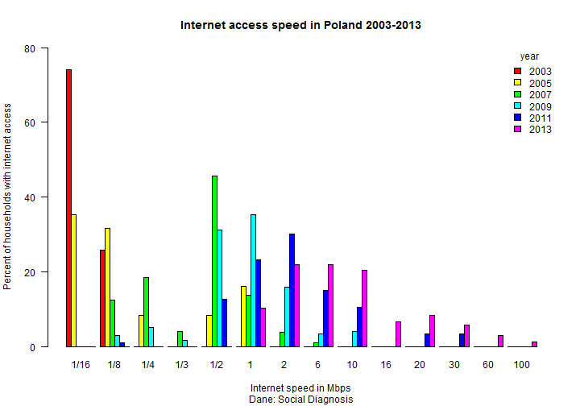
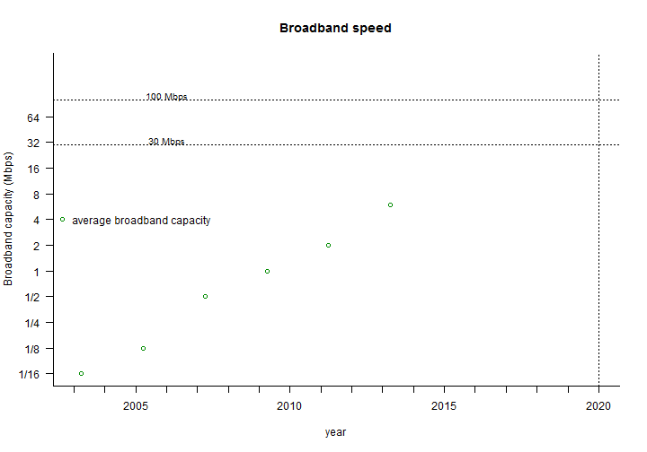
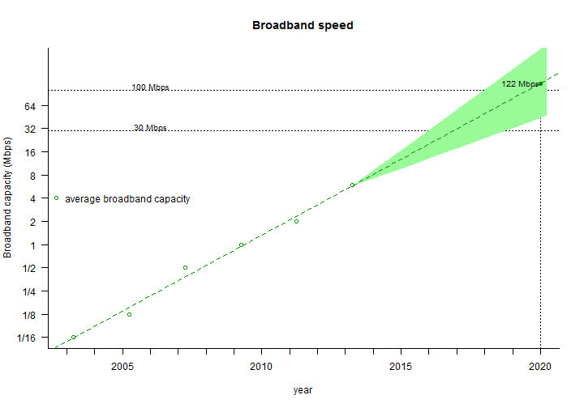

## Introduction

The [Digital Agenda for Europe](<http://ec.europa.eu/digital-agenda/digital-agenda-europe>) is the EU's strategy to help digital technologies, including the internet, to deliver sustainable economic growth. One of the goals of Digital Agenda is to ensure that by 2020 all Europeans can have access to much faster internet (see: [link1](<http://ec.europa.eu/digital-agenda/en/our-goals/pillar-iv-fast-and-ultra-fast-internet-access>)).

"_The EU aims to bring basic broadband to all Europeans by 2013 and to ensure that, by 2020,_ 

* _all Europeans have access to much higher internet speeds of above 30 Mbps and_ 

* _50% or more of European households subscribe to internet access above 100 Mbps._"

These goals and target values may seem too ambitious. 

--- .class #id 

## Shiny app

This [https://dbatorski.shinyapps.io/App3/](https://dbatorski.shinyapps.io/App3/) shiny app was developed by [Dominik Batorski](<pl.linkedin.com/in/dbatorski/>) to verify whether these targets are realistic for Poland, i.e. the sixth largest country in EU.

The app has three tabs:

1. **Introduction** with basic information about the app. 

2. **Internet speed 2003-2013** with a plot that shows the distribution of internet connections with different bandwiths in households in Poland between 2003 and 2013. 

3. **Prediction 2020** where you can test 3 scenarios to predict future average values of internet bandwith as well as percentages of households with 30Mbps and 100Mbps, i.e. the goals of the Digital Agenda.

--- .class #id 

## Internet speed 2003-2013 tab

--- .class #id 

## The doubling trend - a basis for prediction

--- .nobackground .quote

The prediction is based on the observation that:

<q>Between 2003 and 2013 <b>an average internet speed in connected households in Poland doubled every 18 months</b>.</q>

--- .class #id 

## Prediction 2020 tab

--- .class #id 

## Links

This shiny app is available [here](https://dbatorski.shinyapps.io/App3/).

The R code is on [github](https://github.com/dbatorski/DevDataProducts). 

Author: [Dominik Batorski](<pl.linkedin.com/in/dbatorski/>) 
